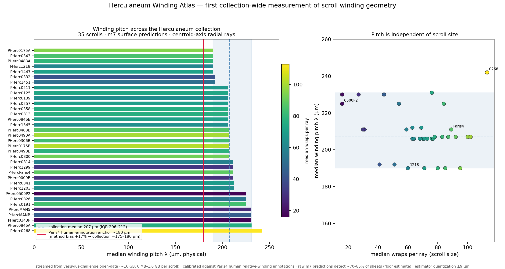
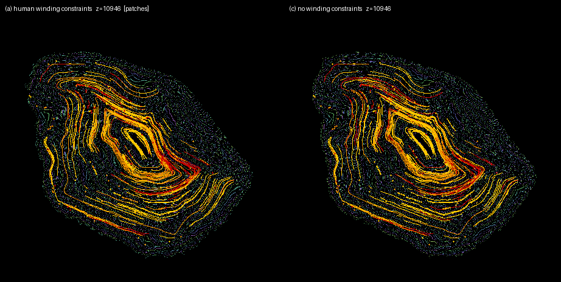
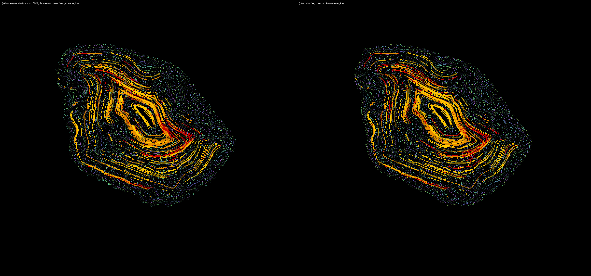

# winding-ruler

Measurement tools and results for **winding evidence** in the Vesuvius
Challenge spiral-fitting pipeline: how much human winding annotations move
the fit, what the published lasagna signal can and cannot do, and the first
collection-wide measurement of Herculaneum scroll winding geometry.

**Full write-up:** [`docs/SUBMISSION_winding_evidence.md`](docs/SUBMISSION_winding_evidence.md)

## Headline results

- Human winding annotations are **statistically redundant where verified
  patches are dense** and worth **+3–5 pp** where patches thin out
  (PHerc Paris 4, two windows × two seeds, train-free evaluation).
- A calibrated estimator recovers human relative-winding labels at **93%**
  for adjacent pairs — yet three progressively better constraint generators
  all degrade the fit. Root causes identified; the bottleneck is signal
  materialization resolution, not the estimator.
- **Winding pitch across the collection: median 207 µm (IQR 206–212),
  34/35 scrolls within 190–242 µm**, independent of scroll size and scan
  campaign. Human-anchored physical pitch ≈175–180 µm.

**Gate overlays** — arms (a) vs (c) on the same W2 slice, near-identical to
the eye; the measured +3–5 pp lives in sub-visual local deviations
(pixel divergence 0.6–0.7%/slice, concentrated in the patch-sparse folds):

## Layout

    concordance/   pairwise Δw estimators v1–v1.5 + distance-confound test
    generators/    constraint generators v1, v2, v2.1, v3 (all evaluated, all post-mortemed)
    evaluation/    ensemble E1, difficulty D1, train-free evaluator recipe, run tags & seeds
    atlas/         winding_atlas v1.2 — streaming collection-wide pitch measurement
    results/       atlas_collection.csv, figures, per-run satisfaction logs
    docs/          submission write-up + method notes

## Reproducing

Everything runs against public data: the spiral-input PHercParis4 dataset
(HF snapshot 2026-07-15, villa @ 37c37de) and the vesuvius-challenge
open-data S3 bucket (streamed; no bulk download needed for the atlas).
Single consumer GPU (RTX 5070, 12 GB) for the fit experiments; the atlas is
CPU + network only. Fixed seeds throughout; pre-registered criteria noted
inline in each script header.

Coordinate note: the dataset README states (z,y,x); point-collection JSONs
are (x,y,z) in practice; track dbm arrays are (z,y,x).

## Credit

Ray/pitch formulation follows Diego-dcv's technical note §2; per-scroll
profiles complement iyando's stitched-instance profiles (PHerc 1218/0332);
lasagna pipeline provenance confirmed by waldkauz; evaluator-shape guidance
from sean (bruniss).

## License

MIT — see [LICENSE](LICENSE).
