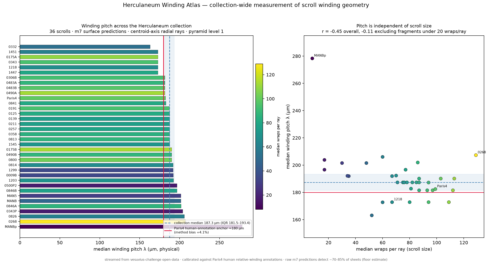

# winding-ruler

Measurement tools and results for **winding evidence** in the Vesuvius
Challenge spiral-fitting pipeline: how much human winding annotations move
the fit, what the published lasagna signal can and cannot do, and the first
collection-wide measurement of Herculaneum scroll winding geometry.

**Full write-up:** [`docs/SUBMISSION_winding_evidence.md`](docs/SUBMISSION_winding_evidence.md)

## Headline results

- Human winding annotations are **statistically redundant where verified
  patches are dense** and worth **+3–5 pp** where patches thin out
  (PHerc Paris 4, two windows × two seeds, train-free evaluation).
- A calibrated estimator recovers human relative-winding labels at **93%**
  for adjacent pairs — yet three progressively better constraint generators
  all degrade the fit. Root causes identified per generator.

  *Revised 22 Jul 2026.* The write-up attributed the residual to signal
  materialization resolution. That was pre-registered as testable and has
  since been falsified: regenerating the lasagna field at 2x finer scaledown
  does not improve winding accuracy (93.0% coarse vs 88.3% fine at dw=1 over
  20 seeds; unit-step concordance 92.3% on both grids). The bottleneck is
  elsewhere.

- **Winding pitch across the collection: a distribution, not a constant.**
  Per-scroll medians center at 187.3 µm (IQR of medians 181.5–193.4;
  35/36 scrolls between 160 and 210 µm), independent of scroll size and
  scan campaign — but pitch varies widely inside each scroll (Paris 4
  alone spans 134–259 µm between quartiles), so no single number
  describes a scroll. The per-scroll λ table is the usable artefact;
  the scalar medians exist to cross-check methods against each other.
  Human-anchored count-based pitch ≈175–180 µm; the physical
  fundamental sits lower — ~145 µm on Paris 4 (see *Resolved, 1 Aug*
  below).

  *Revised 22 Jul 2026.* The original figures (207 µm, IQR 206–212, 34/35
  within 190–242) were measured at pyramid level 2, which merges adjacent
  sheets: rerunning all 36 scrolls at level 1 lowers the pitch by 10.3% on
  average (36/36, sd 2.6) and drops the bias against the human anchor from
  +15.2% to +4.1%. On Paris 4 itself the level-1 estimate is 182.4 µm, +1.3%
  against the anchor. Current data is `results/atlas_collection_v2.csv`;
  `atlas_collection.csv` is kept as the v1 record. See
  `atlas/build_atlas_v2.py` for the derivation.

  *Independent measurements, 30 Jul 2026.* Aleksei Drobkov
  ([AlexeyDrobkovStrikesBack](https://github.com/AlexeyDrobkovStrikesBack)
  on GitHub, alyalya1404 on Discord) first reported agreement using
  these atlas values as his anchor, caught the circularity himself,
  retracted it, and redid both scrolls independently: Paris 4 initially at ~180 µm/turn (Theil-Sen on the winding annotations; retracted by him on 31 Jul as unstable across voxel choices - his harmonic-safe remeasurement reads ~145 µm, under investigation here, see below) and PHerc1203 at
  170-190 µm from radial layer counts on the BM18 volume, cross-checked
  by unrolled-length plausibility. The level-1 entries here read 182.4
  and 192.3, consistent with both. He also supplied the structural note
  this debate was missing: one wrap is one papyrus sheet (~150-200 µm);
  the finer 10-40 µm structure is intra-sheet, so naive per-layer
  counts over-split delaminated sheets. Raw measurements to be linked
  here when he sends them. *Resolved, 1 Aug:* the discriminating test (mode vs median of
  adjacent-sheet gaps on this project's own GT) confirms his mechanism:
  mode 130-140 µm with secondary humps at the 2x/3x delamination
  harmonics. The values in this table are mixture medians of that
  distribution - reproducible periodicity in the surface predictions,
  internally consistent, but NOT physical fundamentals. His
  harmonic-safe methods place the Paris 4 fundamental near ~145 µm
  (CT autocorrelation 150, mesh mode 140, hand 143), and his
  five-scroll table (~145-230) confirms pitch genuinely varies, so the
  per-scroll table remains the right artefact. Every entry here needs
  the mode-vs-median treatment before being read as a fundamental;
  until then, read these values as what they are. Full record:
  constraint-gauge GATE0 A26; his raw numbers and overlays archived
  there.

**Gate overlays** — arms (a) vs (c) on the same W2 slice, near-identical to
the eye; the measured +3–5 pp lives in sub-visual local deviations
(pixel divergence 0.6–0.7%/slice, concentrated in the patch-sparse folds):

## Layout

    concordance/   pairwise Δw estimators v1–v1.5 + distance-confound test
    generators/    constraint generators v1, v2, v2.1, v3 (all evaluated, all post-mortemed)
    evaluation/    ensemble E1, difficulty D1, train-free evaluator recipe, run tags & seeds
    atlas/         winding_atlas v1.2 — streaming collection-wide pitch measurement
    results/       atlas_collection_v2.csv (current), atlas_collection.csv (v1),
                   figures, per-run satisfaction logs
    docs/          submission write-up + method notes

## Reproducing

Everything runs against public data: the spiral-input PHercParis4 dataset
(HF snapshot 2026-07-15, villa @ 37c37de) and the vesuvius-challenge
open-data S3 bucket (streamed; no bulk download needed for the atlas).
Single consumer GPU (RTX 5070, 12 GB) for the fit experiments; the atlas is
CPU + network only. Fixed seeds throughout; pre-registered criteria noted
inline in each script header.

Coordinate note: the dataset README states (z,y,x); point-collection JSONs
are (x,y,z) in practice; track dbm arrays are (z,y,x).

## Credit

Ray/pitch formulation follows Diego-dcv's technical note §2; per-scroll
profiles complement iyando's stitched-instance profiles (PHerc 1218/0332);
lasagna pipeline provenance confirmed by waldkauz; evaluator-shape guidance
from sean (bruniss).

## Tooling note

I work in Portuguese; English drafting and pair-programming were LLM-assisted, 
as in my previous projects. Measurements, experimental decisions, code, and all 
reported numbers are my own and reproducible from this repo.

## License

MIT — see [LICENSE](LICENSE).
